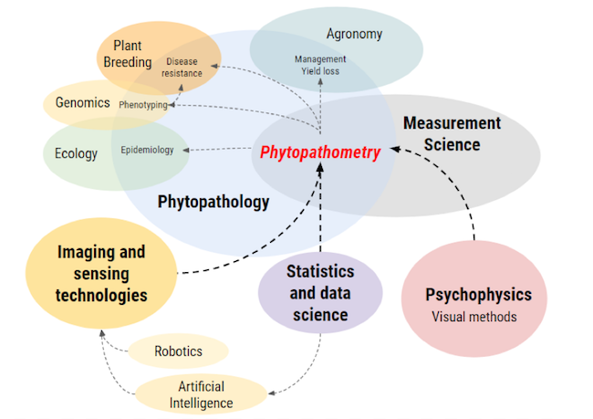
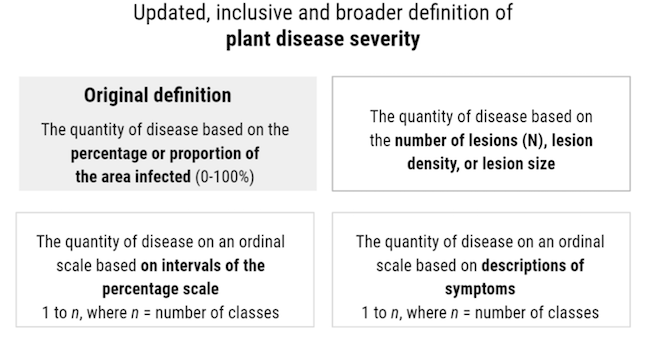
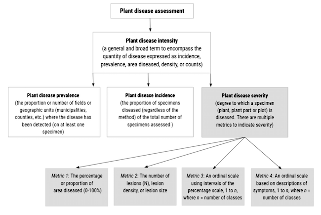

```{r setup, include=FALSE}
library(tidyverse)
library(flexdashboard)
library(janitor)
library(readxl)
library(cowplot)
library(see)
library(plotly)
library(gsheet)
library(crosstalk)

glossary <- gsheet2tbl("https://docs.google.com/spreadsheets/d/1bhFJKizExY5NIHZY2cOLvfuuPFZJAOnjTmkCLh2ylEw/edit?usp=sharing")


sd <- SharedData$new(glossary)

```

## Column

```{r}
```

## Row

### Number of Terms

```{r}
articles <- nrow(glossary)
valueBox(articles,  icon = "fa-pencil")
```

### All terms

```{r}
filter_select("term", "", sd, ~term, multiple = FALSE)
```

<br> <br> <br> <br> <br> <br> <br> <br>
<button onClick="history.go(0);">Show all</button>

**Citation:**

Bock CH, Pethybridge SJ, Barbedo JGA, Esker PD, Mahlein AK, Del Ponte EM
(2021) A phytopathometry glossary for the 21 st century: towards
consistency and precision in intra- and inter-disciplinary dialogues.
Tropical Plant Pathology. In Press

## Column {.tabset data-width="1500px" data-height="500px"}

### Browse terms


```{r}
library(DT)
datatable(sd, 
          escape = FALSE,
          class = 'cell-border stripe',
        rownames = FALSE, colnames = c('Term','Description'), 
          options = list(
  pageLength = 50,
  fontSize = 9,
  style = "bootstrap4",

  lengthMenu = c(25, 50, 100, 500 )
))%>%
formatStyle(
  c('term', 'description'),
  fontSize = '100%')

```


### Introduction to the glossary

<div style="margin:30px">
The two synonymous terms **"Plant Pathometry"** or **"Phytopathometry"**
were first coined by Large (1953, 1966). Phytopathometry as defined by
Nutter et al. (1991) equates with **"disease assessment"** and is the branch
of the discipline of Phytopathology that deals with estimation or
measurement of the amount of plant disease (broadly encompassing
detection, identification and quantification). Large (1953) stated *"At
this point what we have been calling 'disease measurement' or 'disease
assessment' enters a new phase. It becomes a systematized and
specialized method of mensuration with a derived superstructure. In
short, it becomes a branch of plant pathological science, and I think it
deserves a better name. The name that I would now, and hereby, propose
for it is 'Plant Pathometry', from pathos, disease or suffering, and
metron, measure."* 

In the article, Large provides examples (including late blight of potato and choke of cocksfoot) where the new science of phytopathometry was a basis for obtaining valuable information from
plant disease surveys. Thus, phytopathometry may be considered the
branch of the discipline of phytopathology concerned with detection,
identification, and quantification of disease symptoms, or signs of a
pathogen.

Large (1966) stated, and Gregory (1982) reiterated five requirements of
disease measurement in relation to yield loss analyses:

1.  A description of the morphology and development of the healthy crop;
2.  Study of the course of the disease on plants in the field;
3.  Preparing standard area diagrams for detailed assessment of disease
    intensity, followed later by a simplified field assessment key (or
    field key) for field use (a field key was defined as an aid for the
    rapid visual assessment of a leaf disease on whole plants or plots,
    or specific sampling areas (Large 1966));
4.  Conducting field trials over a number of years, assessing disease
    progress using a field key for the disease assessments, and
    recording yields of plots with uncontrolled infection compared with
    plots kept free from disease;
5.  Use of the disease progress curves to select particular assessment
    points (host growth stages) that will define severity in relation to
    loss of yield.

Most certainly requirements 1 to 3 are foundational to phytopathometry
(the healthy state must be known, ranges in disease symptoms understood,
and diagrams, field keys or other methods developed to aid assessments).
However, requirements 4 and 5 are related to the analysis of the disease
assessment results specifically in relation to crop loss assessment.
Disease intensity data are used for epidemiological studies and are the
basis for deriving yield loss models. The tactical view of
phytopathometry described by Large (1966) and reiterated by Gregory
(1982) could be considered an expanded view as it encompasses yield
loss. However, Large (1966) also states "Disease measurement is often
regarded as a synonym for 'estimation of losses,' but this is
misleading." And further states "The main purpose of work on disease
measurement is to improve all plant disease recording or reporting, by
making it not only qualitative but also much more quantitative."

Furthermore, plant disease quantification is vital for a myriad of
reasons, including: understanding the impact of disease on yield,
breeding for plant disease resistance, evaluating and comparing disease
control methods, understanding coevolution of plant and pathogen
populations, and studying disease epidemiology and pathogen ecology
(Madden et al. 2007; Bock et al. 2010; Bock et al. 2016). It underpins
all activities within our discipline and extends into related ones, such
as agronomy, horticulture, and plant breeding.

Sensu lato, phytopathometry might include measurement of the quantity of
the pathogen in the host using molecular methods (but not, for example,
measurements of the pathogen propagules in the air or soil), but we have
chosen not to include molecular methods in this glossary, instead
choosing to restrict the glossary to the more traditional definition of
disease measurement based on symptoms or visible pathogen structures.
Recently, a range of automated sensor-based, digital technologies have
been developed and are being adapted for use in phytopathometry (Bock et
al. 2020; Mahlein 2016). Nonetheless, many of the same terms and
concepts are identical and appropriate regardless of the methods used.
"Plant disease assessment", or phytopathometry is generally a section
(within a chapter on another topic) in plant pathology textbooks as it
is a key method used in many plant pathological studies (Agrios 2005;
Lucas 2002; Tronsmo et al. 2020).

Since ca. 1970, phytopathometry has been closely associated with
botanical epidemiology given its strong quantitative component, and thus
phytopathometry has been a branch of plant pathology typically, but not
exclusively, studied by plant disease epidemiologists. As with textbooks
on plant pathology, plant disease assessment is commonly a chapter or
section within reference or teaching texts on plant disease epidemiology
(Cooke et al. 2006; Madden et al. 2007). Although epidemiologists have
been at the forefront of the research related to phytopathometry,
particularly related to development and evaluation of methods,
phytopathometry is, as noted, critical to many other plant
pathology-related areas of science. 

Based on the history of phytopathometry, its application, and the statements quoted from Large
(1966) we contend that phytopathometry is concerned with the science of
the measurement of plant disease. But phytopathometry is not subservient
to the branches of epidemiology or yield loss, although it provides a
critical service to these and other branches of plant pathology, as well
as other disciplines. Thus, we aim to formulate this glossary to embrace
phytopathometry as a distinct branch of plant pathology as Large (1953)
suggested, and that relates to all applications where disease is
quantified (Fig. 1). We therefore envision phytopathometry at the
overlapping intersection of plant pathology and measurement science but
interfacing closely with three other research disciplines: imaging and
sensing technology, psychophysics, statistics, and being an important
resource to other disciplines that interface with phytopathology (Fig.
1).



Fig. 1 Inter-relation of various disciplines comprising phytopathometry,
at the intersection of plant pathology, measurement science,
psychophysics, imaging and sensor technology (including artificial
intelligence and robotics), and statistics.

Disease quantification has historically been performed visually or by
means of an instrument; hence the use of the two terms 'estimate'
(visual) or 'measurement' (instrument or sensor based). The significant
advances in both imaging and remote sensing technologies in the last two
decades have directly impacted phytopathometry and its associated terms
and concepts. Sensing technologies and image analysis have made
substantial advances, and artificial intelligence has recently opened
new horizons for phytopathometry, especially for obtaining objective
measures of the quantity of plant disease. It has been 20 years since
there was a glossary of terms and concepts used in phytopathometry
(Nutter 2001), which was based on a similar sentinel work 10 years
earlier (Nutter et al. 1991). 

The 1991 glossary was proposed after the
first phase of quantitative research on plant disease assessment (1970
to 1990). It also presented concepts and terms from the perspective of
quantifying crop loss and did not consider the many other purposes of
disease quantification which are also critical. Thus, included herein
are new terms (with respect to those defined in Nutter et al (1991)),
including many from imaging, sensing technology and artificial
intelligence, and more broadly, statistics and measurement science. We
have also refined definitions or updated our understanding of some terms
as used in plant disease assessment (Everitt 1991; Madden et al. 2007;
Bock et al. 2010, 2016 and 2020; Chiang et al. 2020). A call for an
enhanced dialogue between plant pathologists and remote sensing
researchers was made recently (Heim et al. 2019), which is justified
given the explosion in the number of applications of remote sensing and
artificial intelligence to detect or measure plant diseases in the last
five years (Bock et al. 2020). Indeed, the path to success in
sensor-based phytopathometry is transdisciplinary research among plant
pathologists, electrical engineers, agronomists and informatics
specialists (Mahlein 2016).

Before providing the updated and revised list of concepts and
definitions, there are two terms that need to be clearly defined, with
rationale, as they are so pivotal to phytopathometry and the practice of
plant pathology. The first is **"disease measurement"**. Historically this
has referred to visual estimates of plant disease (Large 1966). However,
with the advent of sensor-based technology, disease can now be actually
and accurately measured based on pixels or wave bands with healthy or
diseased characteristics. 

Thus, we contend that disease measurement
refers to those assessments made only using sensors -- and may refer to
the number of individuals diseased, counts of a disease symptom on an
organ, or the proportional quantity of disease on an individual
specimen. In contrast, a "disease estimate" is one obtained through
visual disease assessment, most commonly referring to estimates of the
proportional quantity of disease on a specimen (but could be count-based
data). The second term requiring discussion is "disease severity". Here,
we define **disease severity** as the "degree to which a specimen (plant or
plant part) is diseased. Severity may be described quantitatively on a
scale or as a proportion of the unit area diseased (commonly a
percentage), the number of lesions present, or a ranked numeric order of
descriptions of symptoms in a progression from mild to severe (as
applicable for many systemic diseases)" (Fig. 2). 




Fig. 2 The updated concept and definition of plant disease severity to
encompass the original definition (percentage area diseased, Nutter et
al. 1991), and the metrics of lesion counts or density, and ordinal
scale based measurements using classes based on ether intervals of the
percentage scale or descriptions of symptoms as defined in this article.

This definition differs from most prior definitions that described severity purely on
the basis of area diseased -- but many plant diseases show degrees of
severity without an easily defined area affected (as noted, many
systemic diseases). Thus, severity is broadened to be applicable to
almost all plant diseases where it can be rated quantitatively using
ordinal or ratio scales, and not solely in the narrow sense of
proportion (or percentage) of area diseased as defined by Nutter et al.
(1991). Precedent also encourages the definition of severity to be
revisited and broadened, to provide a terminus communis to metrics of
disease quantification on a specimen. Thus, Seem (1984) referred to
disease density (i.e. lesions per leaf) as a form of severity, although
McRoberts et al. (2003) acknowledged this was not the intended
definition of Nutter et al. (1991), and decided to use density as a
separate measure. We assert that lesion counts (or density) are indeed
one of the metrics of severity. A perusal of the plant pathology
literature will demonstrate that many authors already use these various
metrics as measures of severity as described in numerous journal
articles. For example, Pethybridge et al. (2020) and Cowling and
Gilchrist (1980) referred to lesion counts as disease severity -- the
latter authors also used lesion size as a measure of severity.

Quantitative ordinal scales based on the percentage scale to determine
quantity of disease are well known and widely used, with the stated
purpose of rating disease severity (Horsfall and Barratt 1945; Kousik et
al. 2018; Urea and Haverson 2014). Similarly, qualitative, or
descriptive ordinal scales are used for many diseases where diseased
area estimates are not possible, including many systemic and viral
diseases -- in the literature the rating has often been described as a
disease severity metric (Gottwald et al. 1989; Ling and Scott 2007;
Pascual et al. 2010; Cook et al. 2020; Wang et al. 2020). And there are
many examples of the percentage scale being used to estimate disease
severity, in accordance with the original and narrow Nutter et al.
(1991) definition (Colson et al. 2003; Scherm et al. 2009; Bock et al.
2017). The fact that so many studies have used the term "severity" to
describe the full range of metrics quantifying disease on an individual
specimen suggests that the terms needs redefining to allow plant
pathologists to describe the quantity of disease on a specimen
generically as "disease severity" without having to resort to semantic
gymnastics. In addition, a review of the definitions for disease
intensity, prevalence, and incidence (all of which remain unchanged)
will augment the rationale for the case (for the relationships among
these see Fig. 3). We argue that broadening the term "disease severity"
to include all metrics that can be used to rate a disease quantitatively
using a numeric scale has many practical advantages. Finally, many terms
here are defined specifically as they are used in phytopathometry, and
in some cases (e.g. incidence) may have different meanings in other
disciplines.





Fig. 3 The relationships between plant disease intensity, prevalence,
incidence, and severity based on the concepts and definitions in this
article.

The terms and concepts defined below are from a broad range of sources,
but most notably they stem from those initially defined by Nutter et al.
(1991), and from Nutter (2001), D'Arcy et al. (2001), Madden et al.
(2007), Bock et al. (2010) and Bock et al (2016). Other sentinel
references are included (Everitt 1991; Nutter et al. 2006; McRoberts et
al. 2003; Behmann et al. 2015; Del Ponte et al. 2017; Paulus and Mahlein
2020; Paulus 2019). The Special Topic article of Nutter et al. (1991)
was the outcome of a subcommittee that was appointed by the then Plant
Disease Losses Committee of the American Phytopathological Society. The
list below is compiled by the authors without specific societal
authority, but with the common purpose of bringing together in a single
source, an updated and comprehensive (as of 2021) list of terms,
definitions and concepts currently used or making debuts in
phytopathometry. 

This glossary includes 128 terms, which is an increment
compared to the original glossary that had 58 terms, and which included
terms and concepts related to yield loss measurement. Finally, usage in
the historic literature may vary depending on era and subdiscipline.
Therefore, care should be taken when using terms and we encourage their
context definition when used in individual studies. We are strong
proponents of including operational definitions for technical terms
being used in any study so that readers can clearly understand how the
term is applied in specific situations.
</div>

## Column

```{r}
```
